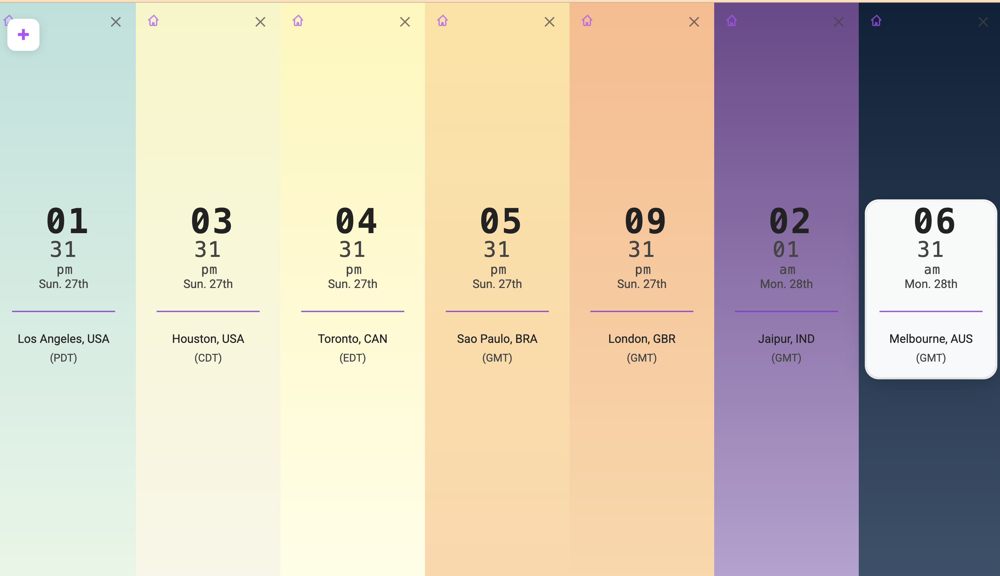

# About Time - Chrome Extension

A sleek and intuitive Chrome extension that replaces your new tab page with a world clock dashboard. Perfect for teams working across different time zones or anyone who needs to keep track of multiple time zones at once.

## Features

- Replaces Chrome's new tab page with a clean time zone dashboard
- Add and remove multiple time zones
- Beautiful, minimal interface
- Easy-to-read time differences between locations

## Installation

To load this extension in Chrome:

1. Open Chrome and navigate to `chrome://extensions/`
2. Enable "Developer mode" by toggling the switch in the top right corner
3. Click "Load unpacked" button in the top left
4. Navigate to the extension directory and select it
5. The extension should now be installed and will activate when you open a new tab

## Contributing

Feel free to submit issues and enhancement requests!

## License

This project is licensed under the terms of the LICENSE file included in the repository.
